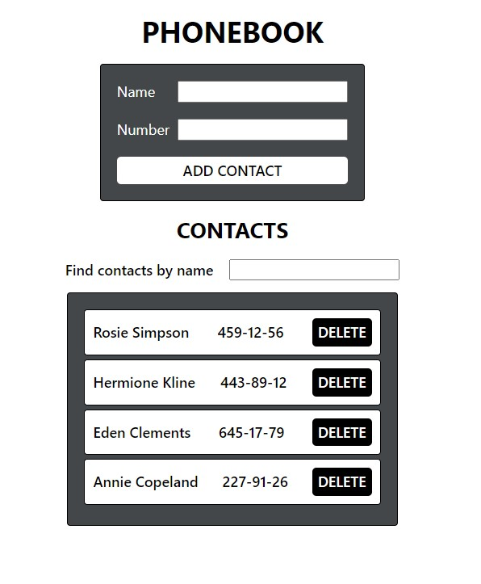

# Phonebook start

#### 1. An application for storing phonebook contacts has been written.

#### 2. The application consists of a form and a list of contacts. The application does not save contacts between different sessions (page refresh). The nanoid package is used to generate identifiers.

#### 3. Expand the functionality of the application by allowing users to add numbers of phones. Added a search field that can be used for filtering contact lists by name.

#### 4. The filtering logic is case insensitive.

#### 5. Prevent the user from adding contacts whose names already exist in the phone book. When I try to perform such an action, I display a notification with a warning.

#### 6. Expanded the functionality of the application, allowing the user to delete earlier saved contacts.

